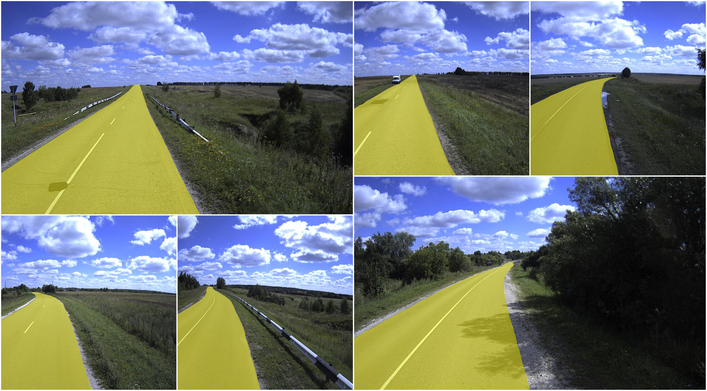

 

  

 

# Roads Annotated  

  <a href="#overview">Overview</a> •
  <a href="#description">Description</a> •
  <a href="#download">Download</a> •
  <a href="#statistics">Statistics</a> •
  <a href="#examples">Examples</a> •

## Overview 

 `roads_annotated` is an example project with 10 images with labeled roads. 

## Description 

`roads_annotated` is a small demo dataset, perfect for flash testing of segmentation models. It can be used to quickly train and test neural networks on a small number of images.

## Download

Direct download: [tar archive](https://cloud.enterprise.deepsystems.io/s/LioXQej4APAlmEO/download) (12,6 MB).

## Statistics

Project contains 1 dataset with 10 images in it, with a total of 10 annotated objects. 

## Examples

  

## Acknowledgement

Images were provided by one of our customers
